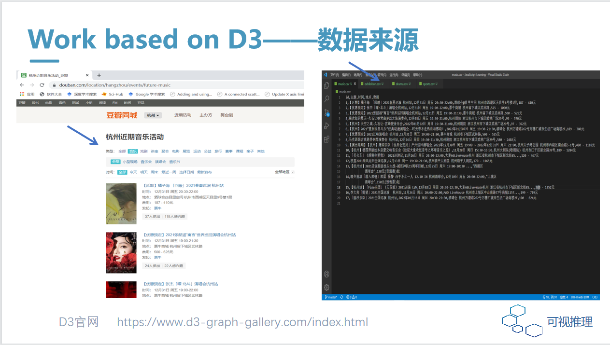
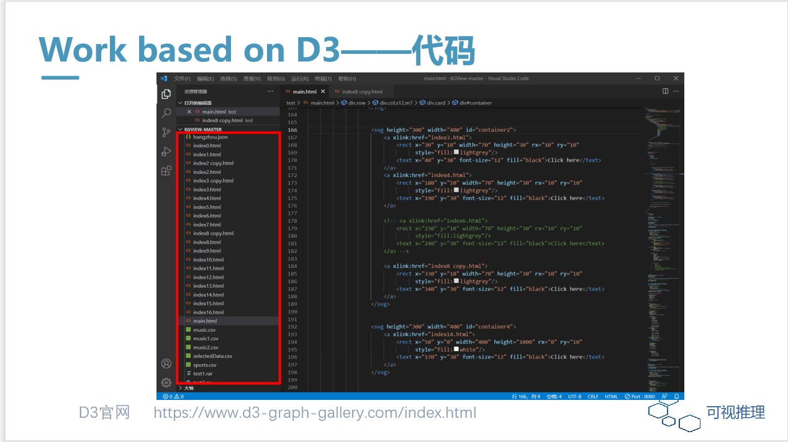
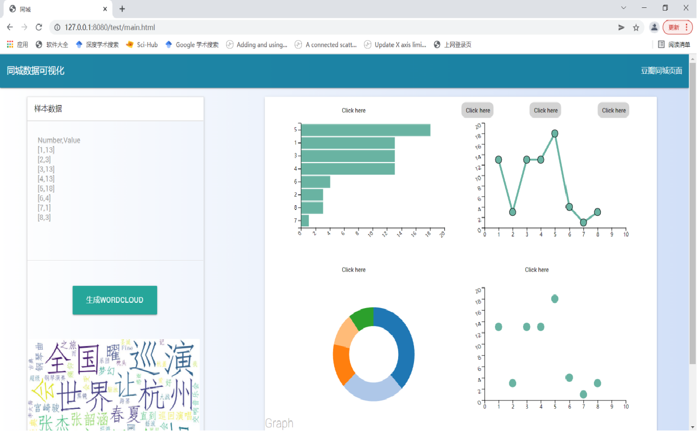
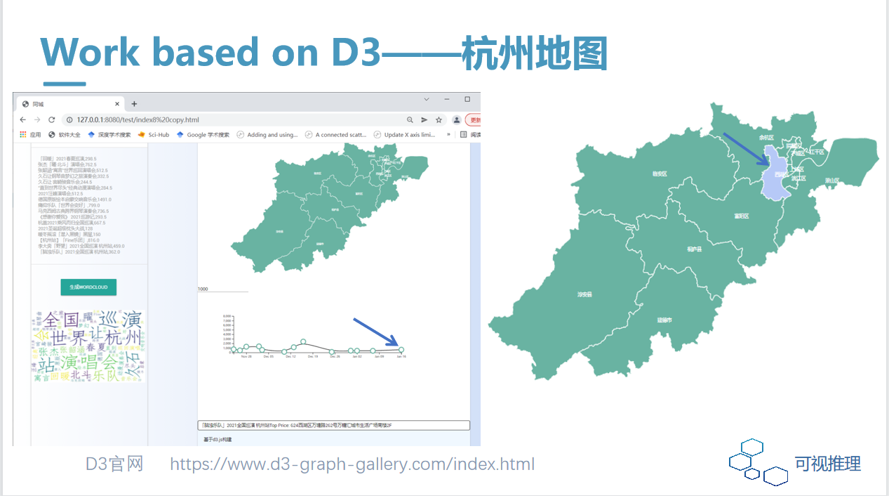

# D3编程实现多页面之间的交互
# 数据是基于近半个月的豆瓣同城音乐活动，含有杭州地图等交互查询

# 1.视频展示

# 2.页面展示
    2.1 数据的来源，以及数据保存的位置

    2.2 全部的代码页面展示

    2.3 index界面，最基本的页面，访问此文件，进而点击，跳转不同的页面

    2.4 d3绘制包含杭州地图（杭州地图来源阿里云网站）

# 3.总文件test里不同类型文件的介绍
# css
页面布局文件
# js
d3需要引用一些js文件
# py
爬虫豆瓣同城音乐的活动数据
# csv（已爬虫好）
保存下来的的豆瓣同城音乐活动数据
# html
基本页面
# jpg
用词云，把豆瓣电影数据保存下来的图片
